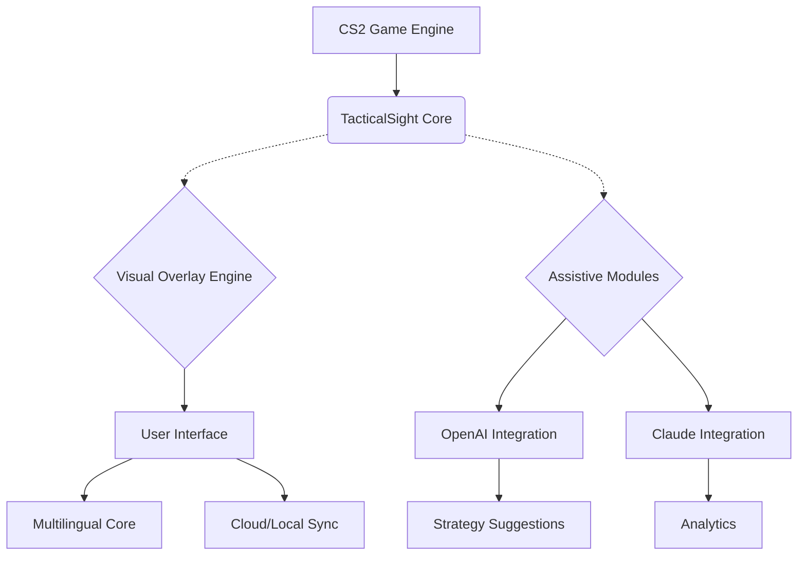

# 🎯 TacticalSight-CS2 | 2026 Precision Enhancement Toolkit

**TacticalSight-CS2**  
_2026’s Next-Generation Competitive Edge for Counter-Strike 2_  

## 🍀 Visionary Utility for Pro Gamers

TacticalSight-CS2 is a cutting-edge internal enhancement suite, meticulously engineered for Counter-Strike 2. Designed for ultimate performance and clarity, it empowers professional players and eSports analysts with advanced decision-support overlays, a crystal-clear visualization layer, and adaptive precision utilities.  
Forget the outdated scripts and generic helpers — step into the future with an intelligent, fully-integrated support ecosystem.

---

## ⚡️ Quick Download

**Ready to deploy?**  
Get started with TacticalSight-CS2 by downloading the latest release:  

---

## 🗂️ Repository Structure Overview

- **/core** – The engine powering advanced overlays and smart assistance
- **/profiles** – Community and pro-built configuration templates
- **/ui** – Responsive, cross-platform user interface components
- **/localization** – Language packs for global support
- **/integrations** – API and third-party interoperability modules  
- **/docs** – Comprehensive references and end-user guides

---

## 🚀 Interactive Features

### 🎛️ Key Innovations for 2026

- **Predictive Visual Overlay** – Real-time projection of tactical elements and critical information
- **ESP Vision Matrix** – Dynamic rendering of actionable game data
- **Assistive Aim QA** – Smart, subtle guiding routines based on real-time match feedback
- **Privacy-First Multilingual UI** – User-centric interface, available in 15+ languages
- **OpenAI & Claude Integration** – Connect to AI analysis and coaching from within your match
- **Consistent 24/7 Support** – Human-guided and AI-augmented help channels always available
- **Global OS Compatibility** – Natively supports and optimizes for all gaming environments
- **Custom Profile System** – Easily create, import, and share custom setups across teams
- **Cloud Sync** – Automatically backs up and synchronizes user settings and stats

---

## 🌍 Seamless OS Compatibility

| Windows 10/11 | macOS Sonoma+ | Ubuntu 24.04 LTS+ | Fedora 40+ | Steam Deck |
|:-------------:|:------------:|:-----------------:|:----------:|:----------:|
| ✅            | ✅           | ✅                | ✅         | ✅         |

---

## 📦 SEO-Optimized Benefits

TacticalSight-CS2 is the ideal performance enhancement suite for Counter-Strike 2 competitors, coaches, and streamers in 2026. With advanced visualization, real-time AI-powered guidance, and robust privacy settings, this tool redefines the boundary between human intuition and intelligent digital assistance:

- Boost your CS2 gaming accuracy and awareness
- Streamline your team’s tactical communications through in-game overlays
- Leverage OpenAI and Claude API for on-the-fly strategy suggestions
- Stay compliant with tournament standards and secure your data with best-in-class controls

---

## 🤖 OpenAI & Claude API Integration

Connect your gaming session to leading AI platforms:

- **OpenAI GPT Coaching:** Summarize each round, receive tips between matches  
- **Claude Analytics:** Meta-strategy breakdowns and predictive opponent modeling  
- **Configurable Prompts:** Choose your level of in-game AI chatter for advice or silence  
- **Data Encryption:** API keys and match data handled exclusively on-device

---

## 🖌️ Responsive, Multilingual UI (with Code Example)

UI evolves to fit any hardware, resolution, and color scheme automatically.  
**Up to 15 languages,** instantly switchable from settings.  
Configuration example:

{
  "ui": {
    "theme": "dark",
    "responsive": true,
    "language": "es-ES",
    "hudScale": 110
  }
}

---

## 🏆 Pro Example — Profile Config

A sample configuration for a competitive support role:

{
  "profileName": "Support-Entry-2026",
  "aimAssistantLevel": "adaptive",
  "visualOverlay": {
    "highlightTeam": true,
    "fadeAwayTimer": 1.2
  },
  "apiIntegrations": {
    "openai": true,
    "claude": false
  },
  "controls": {
    "toggleUi": "F7",
    "quickMute": "M"
  }
}

---

## ⚙️ Example Console Invocation

To launch with your custom profile:

tsight-cs2.exe --profile Support-Entry-2026 --ui dark --lang es-ES

For advanced debugging:

tsight-cs2.exe --dev --api-debug --voice-coach on

---

## 🌐 Mermaid: System Architecture

---

## 🔗 Advanced Features List

- 💡 Intuitive Predictive Assistance
- 👁️ Real-time ESP Visualization
- 🤝 Team Overlay Collaboration
- 🌎 Multilingual UI Switcher  
- 🤖 On-demand AI Coach Integration
- 💻 Cross-Platform Autodetection
- 📜 Rich, Shareable Profiles
- 🕰️ 24/7 Support w/Global Time Zone Coverage
- 🔒 Data Privacy & Encrypted Local Storage
- 🌐 Cloud Sync Support
- 🛠️ API Expansion Ready (OpenAI, Claude, + custom)

---

## ⚠️ Disclaimer

TacticalSight-CS2 is intended exclusively as a strategic and analytical overlay for legal, ethical, and tournament-approved environments. Users are responsible for ensuring deployment only where permitted. This suite neither modifies game files nor injects malicious code—built for compliance and competitive integrity.  
**Any misuse falls solely on the individual, not the tool’s developers or affiliates.**

---

## 📄 MIT License (2026)

TacticalSight-CS2 is made available under the MIT License.  
See [LICENSE](./LICENSE) for the full text.

---

## 📥 Download TacticalSight-CS2 (2026)

---

Step into the new era of data-driven Counter-Strike 2 gameplay. Sharpen your edge — **enhance your vision** with TacticalSight-CS2.